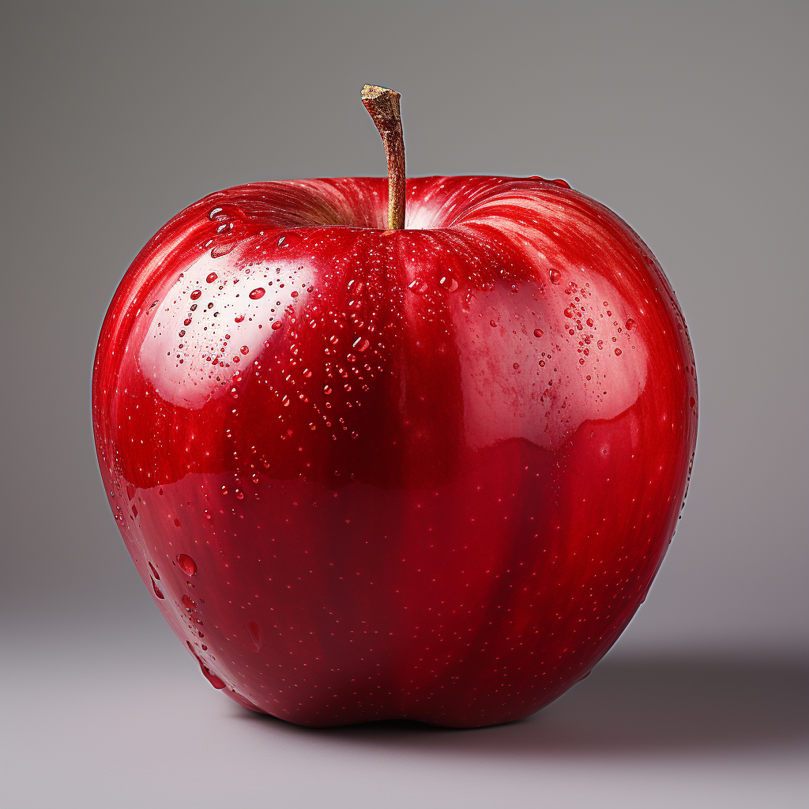
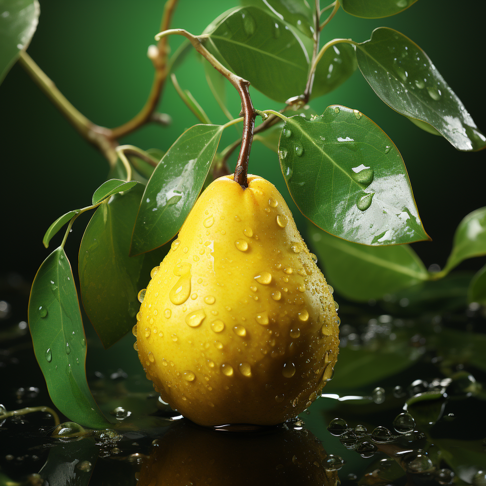
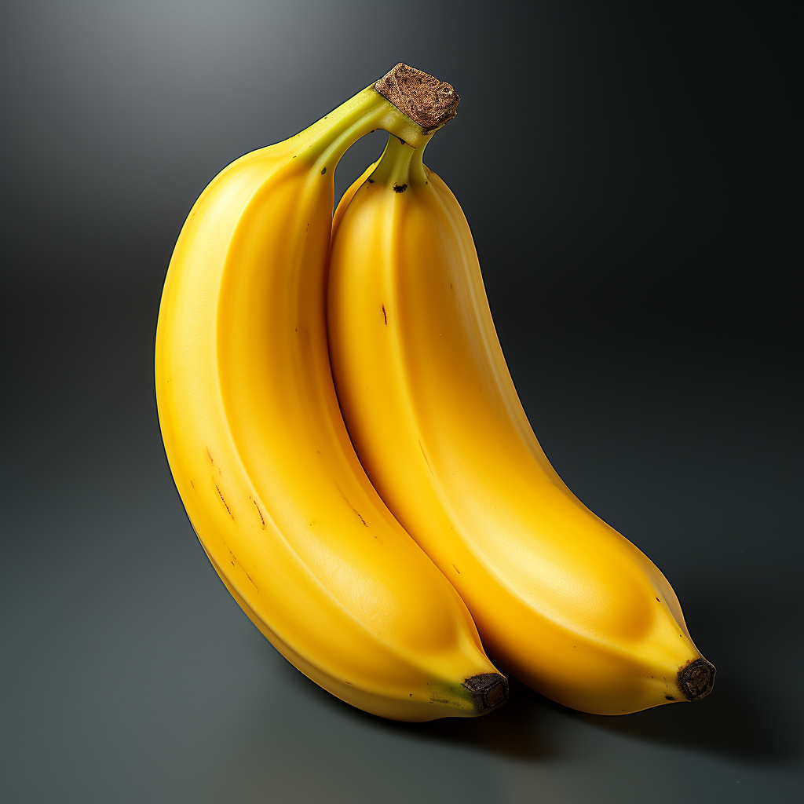
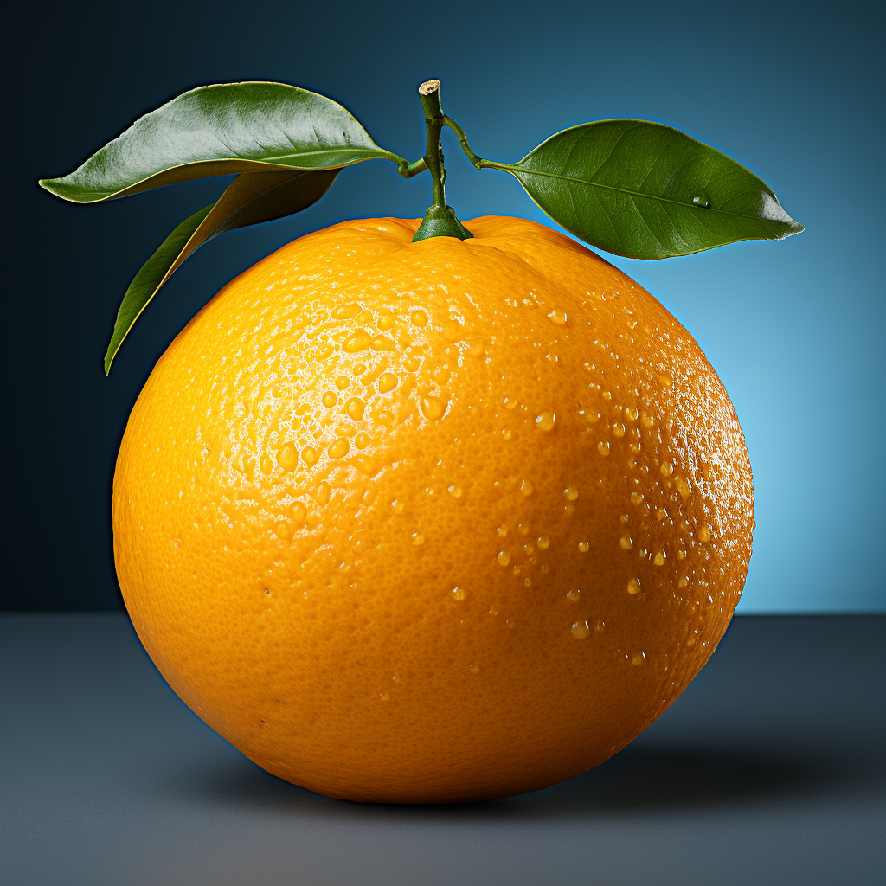
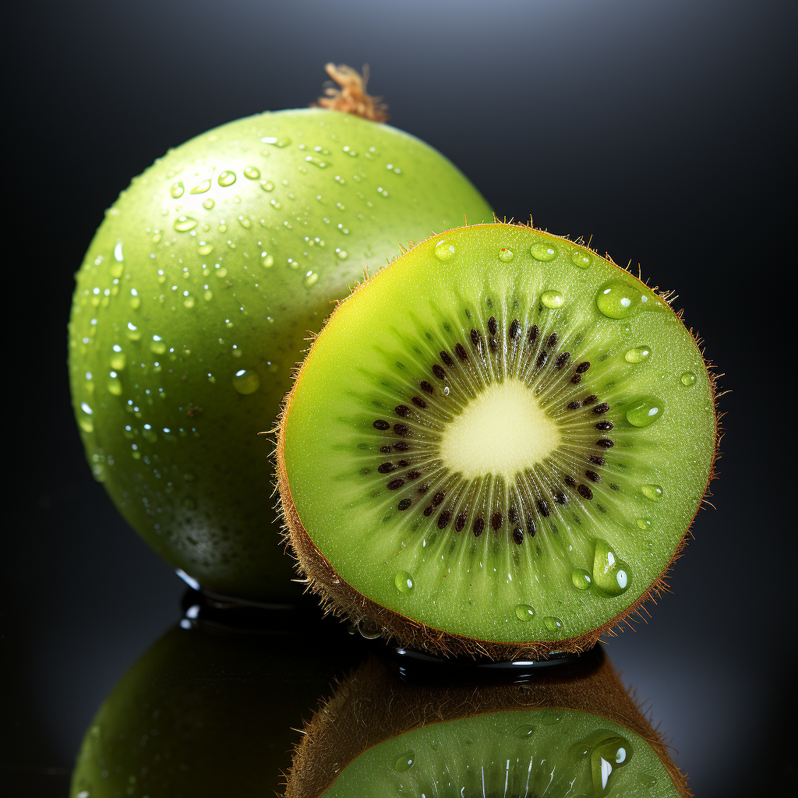
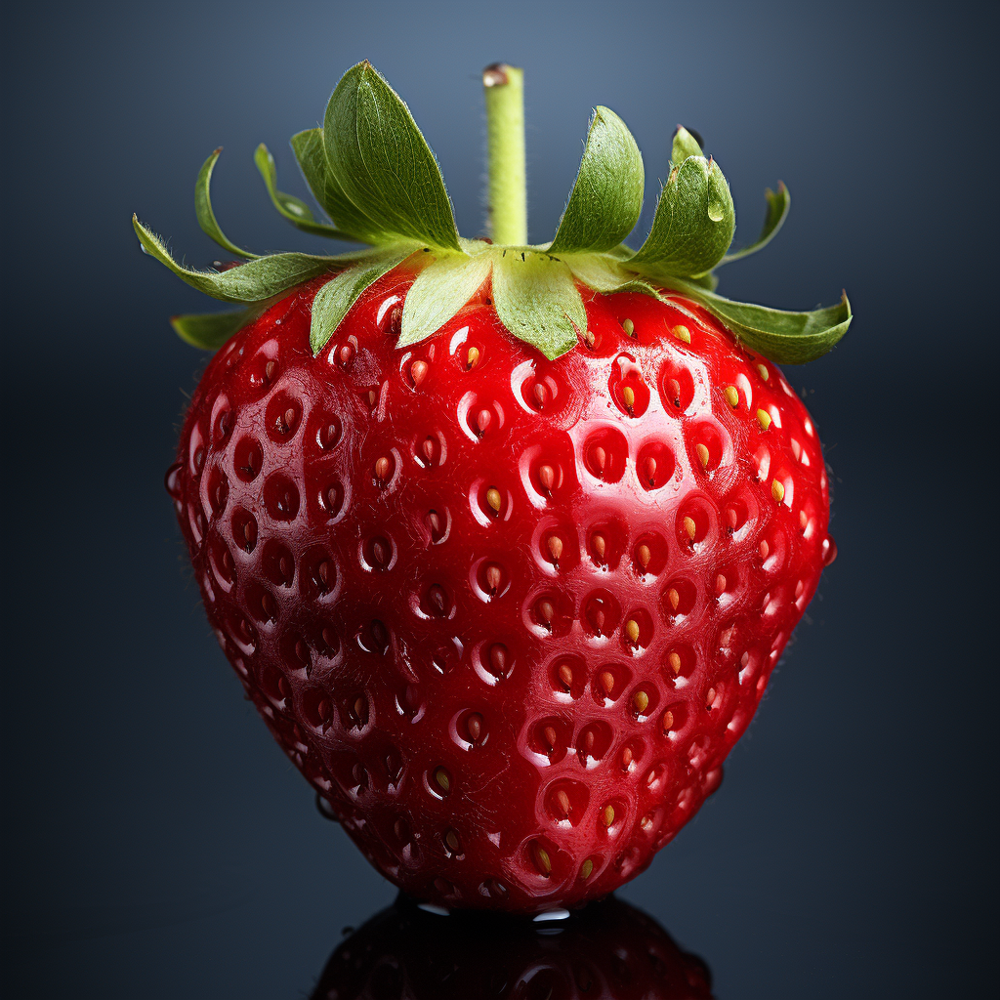
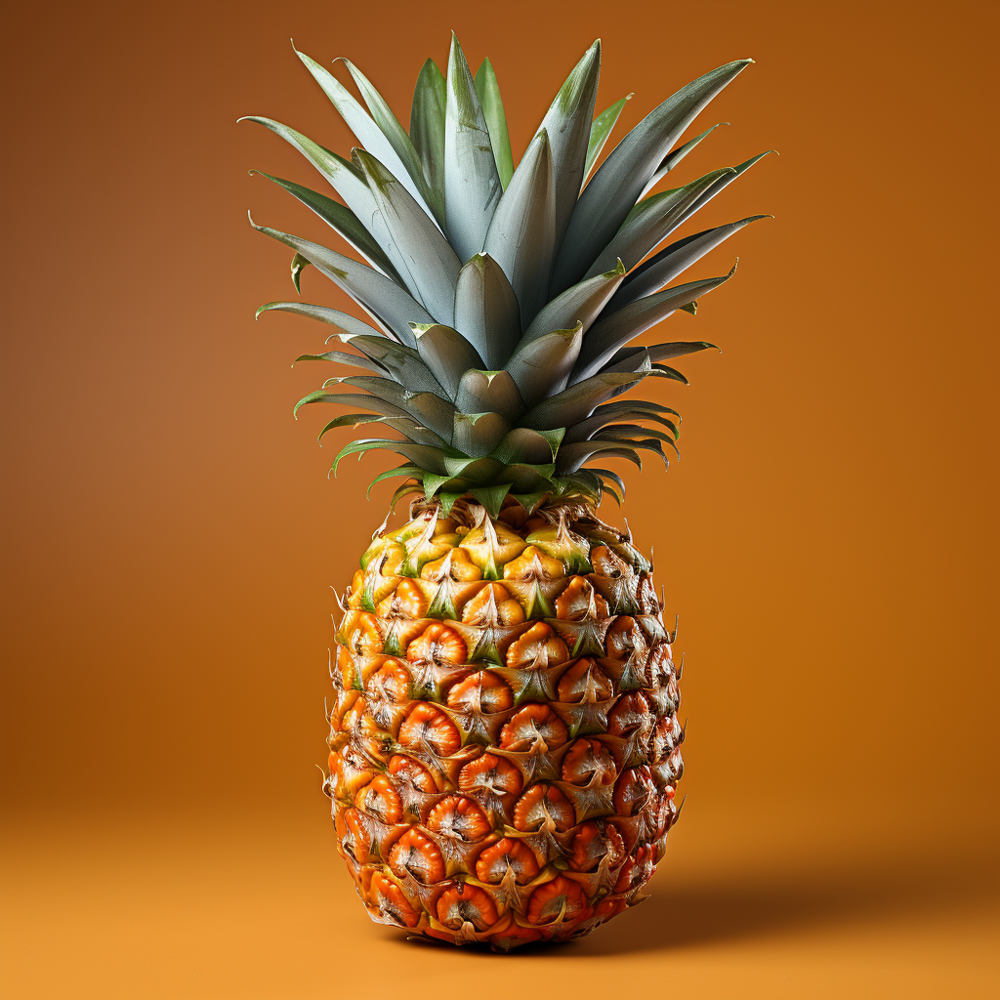
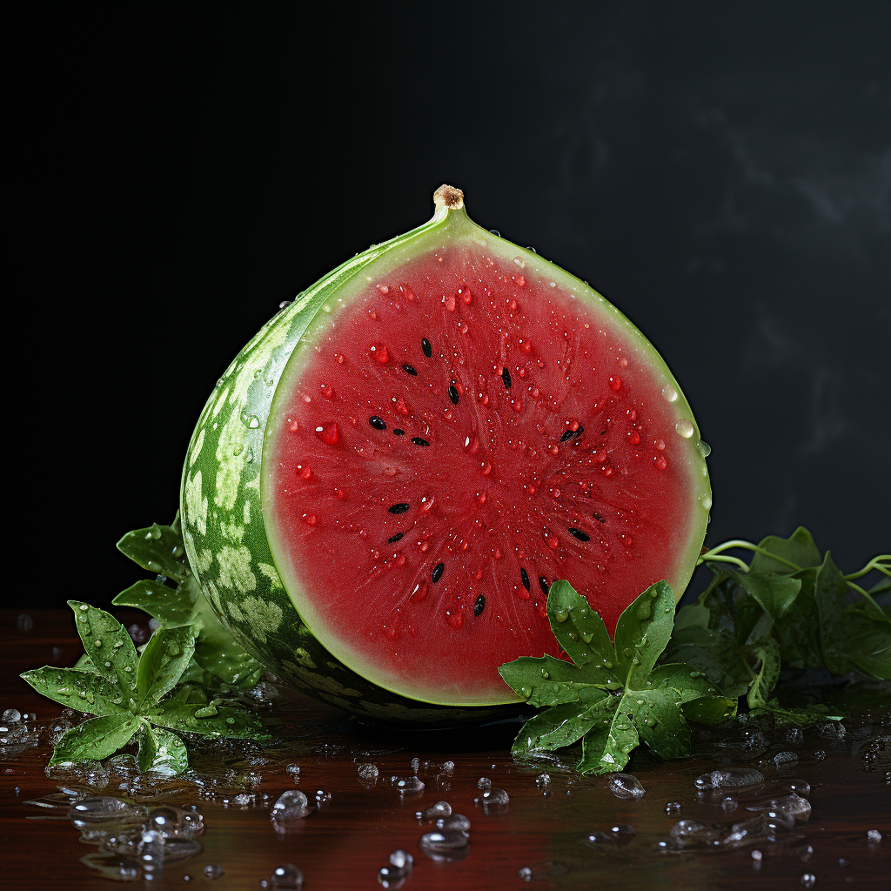

[:arrow_left: Revenir au sommaire des exercices.](/Exercices/README.md#exercices)
<h1 id="exercice9" style="display: flex; align-items: center; justify-content: center;">
    
    &nbsp;Exercice n°9 - Les tableaux
</h1>

## Instructions :

Crée une page web qui répond aux critères suivants :

1. Vous allez utiliser le modèle de page suivant: [ici](https://raw.githubusercontent.com/ZamBoyle/Eqla_HTML/master/Exercices/template.html).
2. Supprimez la balise nav et son contenu: le menu de navigation n'est pas nécessaire pour cet exercice.
2. Vous allez créer un fichier `Exercice9.html` dans le dossier `Exercices` et coller le contenu du modèle dans ce fichier.
3. Mettez un titre à votre page et un titre de niveau 1: Exercice 9 - Les Tableaux
4. Tous vos tableaux auront:
    - un Caption (titre du tableau).
    - un thead, un tbody et éventuellement un tfoot.
    - dans les thead, vous utiliserez l'attribut `scope="col"` pour les cellules d'en-tête de colonne et scope="row" pour les cellules d'en-tête de ligne.
5. Vous ajouterez une nouvelle balise `section` pour chaque partie de l'exercice.

### Partie 1 - Simple tableau
1. Remplacez le titre de niveau 2 par "Tableau de fruits".
2. Vous allez créer un tableau avec 3 colonnes et 3 lignes.
3. La première ligne sera l'en-tête du tableau et contiendra les titres suivants: "Fruit", "Couleur", "Prix".
4. Les dix lignes suivantes contiendront les informations suivantes:
    * Pomme, Rouge, 1.50 €
    * Poire, Jaune, 1.75 €
    * Banane, Jaune, 2.00 €
    * Orange, Orange, 1.25 €
    * Kiwi, Vert, 1.50 €
    * Fraise, Rouge, 2.50 €
    * Framboise, Rouge, 3.00 €
    * Cerise, Rouge, 2.00 €
    * Ananas, Jaune, 3.50 €
    * Pastèque, Vert, 4.00 €
5. Les cellules de la colonne "Prix" seront alignées à droite.
6. Dans le tfoot, vous allez mettre le prix total de tous les fruits. Vous n'aurez qu'une seule cellule dans le tfoot. Le prix total sera de 23 € et aligné à droite et en gras.
7. Vous utiliserez les balises thead, tbody, tfoot, tr, th et td pour créer votre tableau.
8. Vous allez mettre une bordure de 1px à votre tableau via une propriété CSS dans un fichier externe.

### Partie 2 - Tableau avec images
1. Ajoutez le titre de niveau 2 par "Tableau de fruits avec images".
2. Copiez le tableau précédent et collez-le sous le titre.
3. Vous allez modifier l'entête de colonne "Fruit" et mettre l'attribut colspan="2".
4. La première cellule de chaque ligne contiendra une image du fruit de 100px de hauteur.
5. Voici l'adresse des images à utiliser:
    - [Pomme](https://raw.githubusercontent.com/ZamBoyle/Eqla_HTML/master/Exercices/Images/pomme.png)
    - [Poire](https://raw.githubusercontent.com/ZamBoyle/Eqla_HTML/master/Exercices/Images/poire.png)
    - [Banane](https://raw.githubusercontent.com/ZamBoyle/Eqla_HTML/master/Exercices/Images/banane.png)
    - [Orange](https://raw.githubusercontent.com/ZamBoyle/Eqla_HTML/master/Exercices/Images/orange.png)
    - [Kiwi](https://raw.githubusercontent.com/ZamBoyle/Eqla_HTML/master/Exercices/Images/kiwi.png)
    - [Fraise](https://raw.githubusercontent.com/ZamBoyle/Eqla_HTML/master/Exercices/Images/fraise.png)
    - [Framboise](https://raw.githubusercontent.com/ZamBoyle/Eqla_HTML/master/Exercices/Images/framboise.png)
    - [Cerise](https://raw.githubusercontent.com/ZamBoyle/Eqla_HTML/master/Exercices/Images/cerise.png)
    - [Ananas](https://raw.githubusercontent.com/ZamBoyle/Eqla_HTML/master/Exercices/Images/ananas.png)
    - [Pastèque](https://raw.githubusercontent.com/ZamBoyle/Eqla_HTML/master/Exercices/Images/pasteque.png)
6. La deuxième cellule de chaque ligne contiendra le nom du fruit.
7. La hauteur et la largeur de chaque image sera de 100px que vous allez définir via une propriété CSS dans un fichier externe.
8. Enfin, l'image sera cliquable et redirigera vers la page Wikipédia du fruit correspondant:
    * Pomme: https://fr.wikipedia.org/wiki/Pomme
    * Poire: https://fr.wikipedia.org/wiki/Poire
    * Banane: https://fr.wikipedia.org/wiki/Banane
    * Orange: https://fr.wikipedia.org/wiki/Orange_(fruit)
    * Kiwi: https://fr.wikipedia.org/wiki/Kiwi_(fruit)
    * Fraise: https://fr.wikipedia.org/wiki/Fraise
    * Framboise: https://fr.wikipedia.org/wiki/Framboise
    * Cerise: https://fr.wikipedia.org/wiki/Cerise
    * Ananas: https://fr.wikipedia.org/wiki/Ananas
    * Pastèque: https://fr.wikipedia.org/wiki/Past%C3%A8que
9. Vous utiliserez l'attribut `target="_blank"` pour ouvrir la page Wikipédia dans un nouvel onglet avec `rel="noopener noreferrer"` pour des raisons de sécurité.

Votre tableau devra ressembler à ceci: (Le rendu sur Github peut être différent de votre rendu local)
 <table>
      <thead>
          <tr>
              <th scope="col" colspan="2">Fruit</th>
              <th scope="col">Couleur</th>
              <th scope="col">Prix</th>
          </tr>
      </thead>
      <tbody>
          <tr>
              <td></td>
              <td>Pomme</td>
              <td>Rouge</td>
              <td style="text-align: right;">1.50 €</td>
          </tr>
          <tr>
              <td></td>
              <td>Poire</td>
              <td>Jaune</td>
              <td style="text-align: right;">1.75 €</td>
          </tr>
          <tr>
              <td></td>
              <td>Banane</td>
              <td>Jaune</td>
              <td style="text-align: right;">2.00 €</td>
          </tr>
          <tr>
              <td></td>
              <td>Orange</td>
              <td>Orange</td>
              <td style="text-align: right;">1.25 €</td>
          </tr>
          <tr>
              <td></td>
              <td>Kiwi</td>
              <td>Vert</td>
              <td style="text-align: right;">1.50 €</td>
          </tr>
          <tr>
              <td></td>
              <td>Fraise</td>
              <td>Rouge</td>
              <td style="text-align: right;">2.50 €</td>
          </tr>
          <tr>
              <td></td>
              <td>Framboise</td>
              <td>Rouge</td>
              <td style="text-align: right;">3.00 €</td>
          </tr>
          <tr>
              <td></td>
              <td>Cerise</td>
              <td>Rouge</td>
              <td style="text-align: right;">2.00 €</td>
          </tr>
          <tr>
              <td></td>
              <td>Ananas</td>
              <td>Jaune</td>
              <td style="text-align: right;">3.50 €</td>
          </tr>
          <tr>
              <td></td>
              <td>Pastèque</td>
              <td>Vert</td>
              <td style="text-align: right;">4.00 €</td>
          </tr>
      </tbody>
      <tfoot>
          <tr>
              <td colspan="3">Total</td>
              <td style="text-align: right; font-weight: bold;">23.00 €</td>
          </tr>
      </tfoot>
  </table>

### Partie 3 - Coloration des lignes
1. Ajoutez le titre de niveau 2 par "Tableau de fruits avec images et lignes colorées".
2. Reprenez le tableau précédent et collez-le sous le titre.
3. Vous allez colorer les lignes de votre tableau de la manière suivante:
    * Les lignes paires seront colorées avec la couleur: **lightpink**.
    * Les lignes impaires seront colorées avec la couleur: **lightblue**.
4. Vous utiliserez un fichier externe pour colorer les lignes.

<!-- ## Correction
 Comparez le rendu de votre page avec la page web suivante: [Correction Exercie9](http://zamboyle.github.io/htmlpreview/?https://github.com/ZamBoyle/Eqla_HTML/blob/master/Exercices/Corrections/pages/Exercice9.html). -->

[:arrow_left: Revenir au sommaire des exercices.](/Exercices/README.md#exercices)

---
&copy; 2023 [Johnny Piette](https://github.com/ZamBoyle).  
  
Ce travail est licencié sous [Creative Commons Attribution 4.0 International License](https://creativecommons.org/licenses/by/4.0/).   
_Vous pouvez copier, modifier, distribuer et représenter ce travail, même à des fins commerciales, à condition de donner le crédit approprié, fournir un lien vers la licence, et indiquer si des modifications ont été effectuées._
