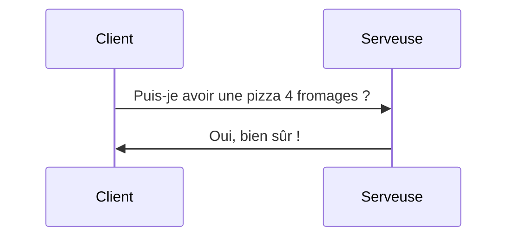
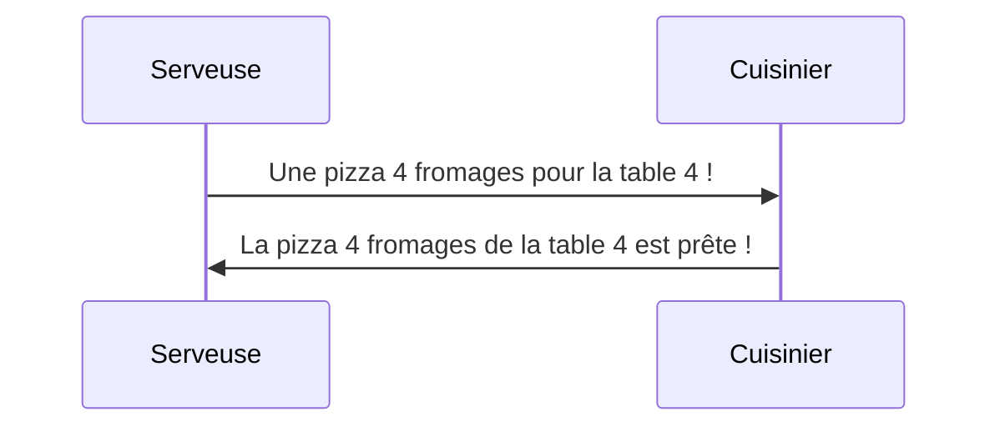
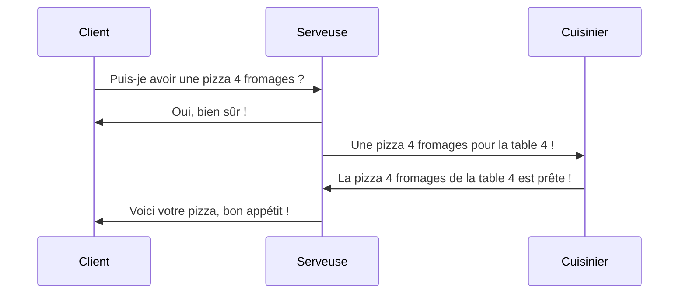
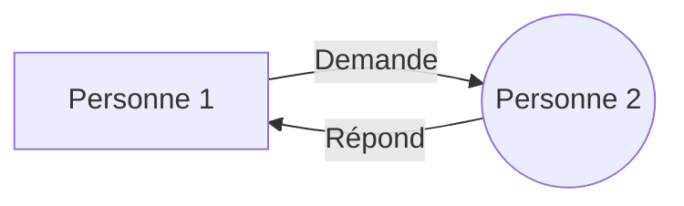
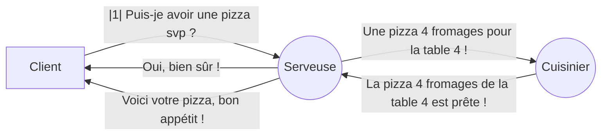

<h1 align="center">EQLA Cours d'HTML</h1>

## Sommaire

<!-- @import "[TOC]" {cmd="toc" depthFrom=1 depthTo=6 orderedList=false} -->

<!-- code_chunk_output -->

- [Sommaire](#sommaire)
- [1. Introduction](#1-introduction)
- [2. Historique](#2-historique)
- [3. Schéma de la communication entre deux personnes](#3-schéma-de-la-communication-entre-deux-personnes)
  - [3.1 Exemple 1: un client et une serveuse](#31-exemple-1-un-client-et-une-serveuse)
  - [3.2 Exemple 2: une serveuse et un cuisinier](#32-exemple-2-une-serveuse-et-un-cuisinier)
  - [3.3 Exemple 3: un client, une serveuse et un cuisinier](#33-exemple-3-un-client-une-serveuse-et-un-cuisinier)
- [4. Schéma de communication entre un navigateur web et un serveur web](#4-schéma-de-communication-entre-un-navigateur-web-et-un-serveur-web)
- [Les versions](#les-versions)
- [Les navigateurs](#les-navigateurs)
- [Les éditeurs de texte](#les-éditeurs-de-texte)
- [Les outils](#les-outils)
- [Structure d'une page HTML](#structure-dune-page-html)

<!-- /code_chunk_output -->


## 1. Introduction
Aujourd'hui, Internet fait partie intégrante de nos vies. Nos smartphones, notre télé, notre montre, notre voiture, notre maison, ... sont connectés à Internet. Nous utilisons Internet pour communiquer avec nos amis, pour regarder des vidéos, pour écouter de la musique, pour jouer à des jeux, pour faire des recherches, ... Beaucoup d'applications sont maintenant des applications web car le web d'hier a évolué pour devenir le web d'aujourd'hui: moderne, rapide et performant.  

Les applications web sont des applications qui s'exécutent dans un navigateur web.   

Le HTML est un langage qui permet de créer des pages web. Il est utilisé conjointement avec le CSS et le JavaScript. Le HTML est un langage de balisage, c'est-à-dire qu'il permet de structurer un document à l'aide de balises qui permettent de définir la structure d'un document.

Une dernière chose, Internet ce n'est pas Google. Souvent on entend quelqu'un dire:"Voilà, je suis sur Internet !" alors qu'ils ont simplement ouvert un navigateur Web.

Internet, c'est LE réseau de réseaux. C'est un réseau qui permet de connecter des ordinateurs entre eux en utilisant le protocole TCP/IP (Transmission Control Protocol/Internet Protocol).

Le protocole TCP/IP est un protocole qui permet de transférer des données sur Internet. Le protocole TCP/IP est composé de deux parties : le client et le serveur. Le client envoie une requête au serveur. Le serveur envoie une réponse au client. 

Internet est composé de plusieurs couches. La couche la plus basse est la couche physique. La couche la plus haute est la couche applicative. Le HTML est un langage de la couche applicative. Le HTML est utilisé conjointement avec le CSS et le JavaScript. Le CSS est un langage qui permet de mettre en forme une page web. Le JavaScript est un langage qui permet d'animer une page web.

## 2. Historique
Le HTML a été inventé par **Tim Berners-Lee** en 1991. Il a été inventé pour permettre aux scientifiques de partager leurs recherches. Un belge, **Robert Cailliau**, a aidé Tim Berners-Lee à créer le HTML. Ensemble, ils ont créé le premier navigateur web, le premier serveur web et le premier site web. Le premier site web a été mis en ligne le 6 août 1991. Le premier site web est toujours en ligne. Il est accessible à l'adresse suivante : http://info.cern.ch/hypertext/WWW/TheProject.html.

Le protocole HTTP a été créé en 1991. Le **protocole HTTP** permet de transférer des données sur le web. Le protocole HTTP est composé de deux parties : le client et le serveur. Le client envoie une requête au serveur. Le serveur envoie une réponse au client. Le protocole HTTP est un protocole sans état, c'est-à-dire qu'il ne garde pas en mémoire les requêtes précédentes.

Sur **Auvio**, allez voir la vidéo suivante : [La méconnue naissance du Web](https://auvio.rtbf.be/media/la-meconnue-naissance-du-web?id=2855400) (Il faut avoir un compte sur Auvio pour pouvoir l'écouter).

Ensuite, vous pourrez écouter le livre Alexandria qui relate l'histoire du web  [ici](Alexandria/README.ME):


## 3. Schéma de la communication entre deux personnes
### 3.1 Exemple 1: un client et une serveuse
Dans un restaurant, nous avons un client demande à la serveuse: **"Puis-je avoir une pizza 4 fromages svp ?"**. La serveuse répond: **"Oui, bien sûr"**. La serveuse va ensuite transmettre la commande au cuisinier. Le cuisinier va préparer la pizza. La serveuse va ensuite apporter la pizza au client. Le client va manger la pizza.

Représentons le schéma de la communication entre la serveuse et le client:


| Émetteur | Récepteur | Message                        |
|----------|--------------|--------------------------------|
| CLIENT   | SERVEUSE     | _Puis-je avoir une pizza ?_    |
| SERVEUSE | CLIENT       | _Oui, bien sûr !_              |


Dans la communication entre le client et la serveuse, les deux personnes vont devoir utiliser un langage commun: **un protocole de communication**. Le langage commun est le français. Le client et la serveuse vont devoir utiliser la même langage pour pouvoir communiquer. Une fois la même langue utilisée, le client va pouvoir demander à la serveuse une pizza. La serveuse va pouvoir répondre au client qu'elle va lui apporter une pizza. Le client va pouvoir manger la pizza. Grâce à cette langue commune, ils ont pu échanger des messages.

### 3.2 Exemple 2: une serveuse et un cuisinier
La serveuse va ensuite transmettre la commande au cuisinier:**"Une pizza 4 fromages pour la table 4 !"** Le cuisinier va préparer la pizza. Quand la pizza sera préparée, le cuisiniez fera sonner une cloche et pourrais dire:**"La pizza 4 fromages de la table 4 est prête !"** La serveuse va ensuite apporter la pizza au client et lui dire:**"Voici votre pizza, bon appétit !"** Le client mange ensuite la pizza.

Représentons le schéma de la communication entre la serveuse et le client:
[Eviter le schéma](#avoidDiagram2)


<div id='avoidDiagram3'></div>

| Émetteur  | Récepteur | Message                                               |
|-----------|--------------|-------------------------------------------------------|
| SERVEUSE  | CUISINIER    | _Une pizza 4 fromages pour la table 4 !_              |
| CUISINIER | SERVEUSE     | _La pizza 4 fromages de la table 4 est prête !_       |


### 3.3 Exemple 3: un client, une serveuse et un cuisinier
Nous allons reprendre les deux exemples précédents et les mettre ensemble.

Le client va demander à la serveuse:**"Puis-je avoir une pizza 4 fromages svp ?"**. La serveuse va répondre:**"Oui, bien sûr"**. La serveuse va ensuite transmettre la commande au cuisinier:**"Une pizza 4 fromages pour la table 4 !"** Le cuisinier va préparer la pizza. Quand la pizza sera préparée, le cuisiniez fera sonner une cloche et pourrais dire:**"La pizza 4 fromages de la table 4 est prête !"** La serveuse va ensuite apporter la pizza au client et lui dire:**"Voici votre pizza, bon appétit !"** Le client mange ensuite la pizza.

Représentons le schéma de la communication entre le client, la serveuse et le cuisinier:
[Eviter le schéma](#avoidDiagram3)

<div id='avoidDiagram3'></div>

| Émetteur   | Récepteur | Message                                       |
|------------|--------------|-----------------------------------------------|
| CLIENT     | SERVEUR      | _Puis-je avoir une pizza 4 fromages ?_        |
| SERVEUSE   | CLIENT       | _Oui, bien sûr !_                             |
| SERVEUSE   | CUISINIER    | _Une pizza 4 fromages pour la table 4 !_      |
| CUISINIER  | SERVEUSE     | _La pizza 4 fromages de la table 4 est prête !_|
| SERVEUSE   | CLIENT       | _Voici votre pizza, bon appétit !_            |

## 4. Schéma de communication entre un navigateur web et un serveur web
Nous pourrions comparer la serveuse à un navigateur web, le cuisinier à un serveur web, le client à un utilisateur et la pizza à une page web.

Le navigateur va initier la communication en demandant au serveur web d'envoyer réponse: une page web. Le serveur web va ensuite envoyer la page web au navigateur web. Le navigateur web va ensuite afficher la page web.


Le schéma de la communication entre deux personnes est le suivant : 




## Les versions
Le HTML a connu plusieurs versions. La première version est la version 1.0. La dernière version est la version 5.0. La version 5.0 est la version actuelle.

## Les navigateurs
Les navigateurs sont des logiciels qui permettent d'afficher des pages web. Les navigateurs les plus connus sont Google Chrome, Mozilla Firefox, Microsoft Edge et Safari.

## Les éditeurs de texte
Les éditeurs de texte sont des logiciels qui permettent d'écrire du code. Les éditeurs de texte les plus connus sont Visual Studio Code, Atom, Sublime Text et Notepad++.

## Les outils
Les outils sont des logiciels qui permettent d'aider les développeurs à coder plus rapidement et plus efficacement. Les outils les plus connus sont Emmet, Prettier, Live Server et Live Sass Compiler.


## Structure d'une page HTML
Une page HTML est composée de balises. Une balise est un élément qui permet de structurer un document. Une balise est composée d'un nom et d'un contenu. Le nom d'une balise est entouré de chevrons. Le contenu d'une balise est placé entre la balise ouvrante et la balise fermante. Une balise peut être vide, c'est-à-dire qu'elle n'a pas de contenu. 


```html
<!DOCTYPE html>
```

Dans ce cours, nous allons apprendre les bases de l'HTML. Nous allons apprendre à créer une page web, à la structurer, à la mettre en forme et à l'animer. Nous allons aussi apprendre à utiliser des outils pour nous aider à coder plus rapidement et plus efficacement. 


