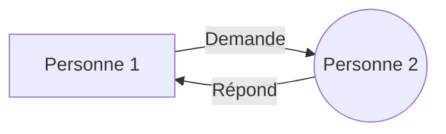

<h1 align="center">EQLA Cours d'HTML</h1>

## Sommaire
- [Introduction](#introduction)


## Introduction
Le HTML est un langage de programmation qui permet de créer des pages web. Il est utilisé conjointement avec le CSS et le JavaScript. Le HTML est un langage de balisage, c'est-à-dire qu'il permet de structurer un document. Il est composé de balises qui permettent de définir la structure d'un document. 

## Historique
Le HTML a été inventé par Tim Berners-Lee en 1991. Il a été inventé pour permettre aux scientifiques de partager leurs recherches. Un belge, Robert Cailliau, a aidé Tim Berners-Lee à créer le HTML. Ensemble, ils ont créé le premier navigateur web, le premier serveur web et le premier site web. Le premier site web a été mis en ligne le 6 août 1991. Le premier site web est toujours en ligne. Il est accessible à l'adresse suivante : http://info.cern.ch/hypertext/WWW/TheProject.html.

Le protocole HTTP a été créé en 1991. Le protocole HTTP permet de transférer des données sur le web. Le protocole HTTP est composé de deux parties : le client et le serveur. Le client envoie une requête au serveur. Le serveur envoie une réponse au client. Le protocole HTTP est un protocole sans état, c'est-à-dire qu'il ne garde pas en mémoire les requêtes précédentes.

## Schéma de la communication entre deux personnes
Dans un restaurant, nous avons une serveuse qui vient prendre la commande du client en demandant par exemple:"Que désirez-vous manger?". 
Le client répond par exemple:"Je voudrais une pizza".

La serveuse va ensuite transmettre la commande au cuisinier. Le cuisinier va préparer la pizza. La serveuse va ensuite apporter la pizza au client. Le client va manger la pizza.

Reprentons le schéma de la communication entre la serveuse et le client:
    
    ```mermaid
    graph LR
    A[Client] -- Demande --> B((Serveuse))
    B -- Répond --> A
    ```

    


Nous pourrions comparer la serveuse à un navigateur web. Nous pourrions comparer le cuisinier à un serveur web. Nous pourrions comparer la pizza à une page web.


Le schéma de la communication entre deux personnes est le suivant : 




## Les versions
Le HTML a connu plusieurs versions. La première version est la version 1.0. La dernière version est la version 5.0. La version 5.0 est la version actuelle.

## Les navigateurs
Les navigateurs sont des logiciels qui permettent d'afficher des pages web. Les navigateurs les plus connus sont Google Chrome, Mozilla Firefox, Microsoft Edge et Safari.

## Les éditeurs de texte
Les éditeurs de texte sont des logiciels qui permettent d'écrire du code. Les éditeurs de texte les plus connus sont Visual Studio Code, Atom, Sublime Text et Notepad++.

## Les outils
Les outils sont des logiciels qui permettent d'aider les développeurs à coder plus rapidement et plus efficacement. Les outils les plus connus sont Emmet, Prettier, Live Server et Live Sass Compiler.


## Structure d'une page HTML
Une page HTML est composée de balises. Une balise est un élément qui permet de structurer un document. Une balise est composée d'un nom et d'un contenu. Le nom d'une balise est entouré de chevrons. Le contenu d'une balise est placé entre la balise ouvrante et la balise fermante. Une balise peut être vide, c'est-à-dire qu'elle n'a pas de contenu. 


```html
<!DOCTYPE html>
```

Dans ce cours, nous allons apprendre les bases de l'HTML. Nous allons apprendre à créer une page web, à la structurer, à la mettre en forme et à l'animer. Nous allons aussi apprendre à utiliser des outils pour nous aider à coder plus rapidement et plus efficacement. 


